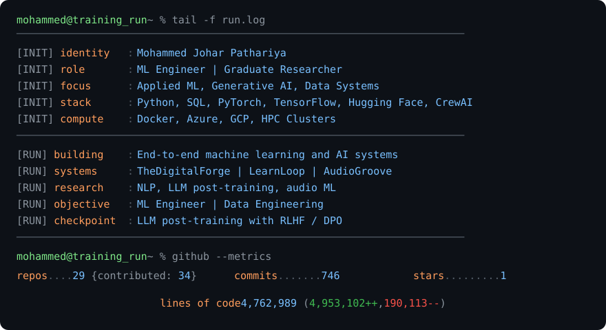

  <picture>
    <source media="(prefers-color-scheme: dark)" srcset="dark_mode.svg" />
    <source media="(prefers-color-scheme: light)" srcset="light_mode.svg" />
    
  </picture>

  <a href="https://www.linkedin.com/in/mjpathariya">linkedin.com/in/mjpathariya</a>
  &nbsp;&nbsp;·&nbsp;&nbsp;
  <a href="https://mjpathariya.com">mjpathariya.com</a>
  &nbsp;&nbsp;·&nbsp;&nbsp;
  <a href="mailto:mjpathariya7@gmail.com">mjpathariya7@gmail.com</a>

Stats card mechanism inspired by <a href="https://github.com/Andrew6rant/Andrew6rant">Andrew Grant's implementation</a>.

